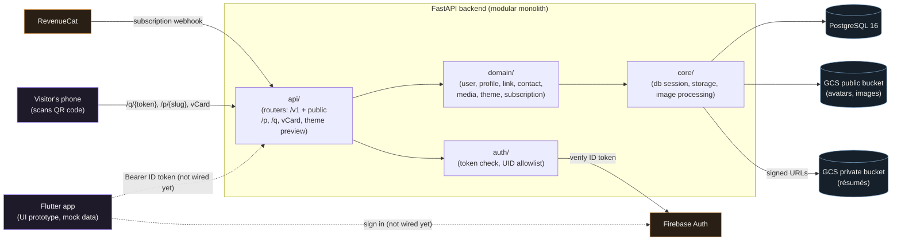
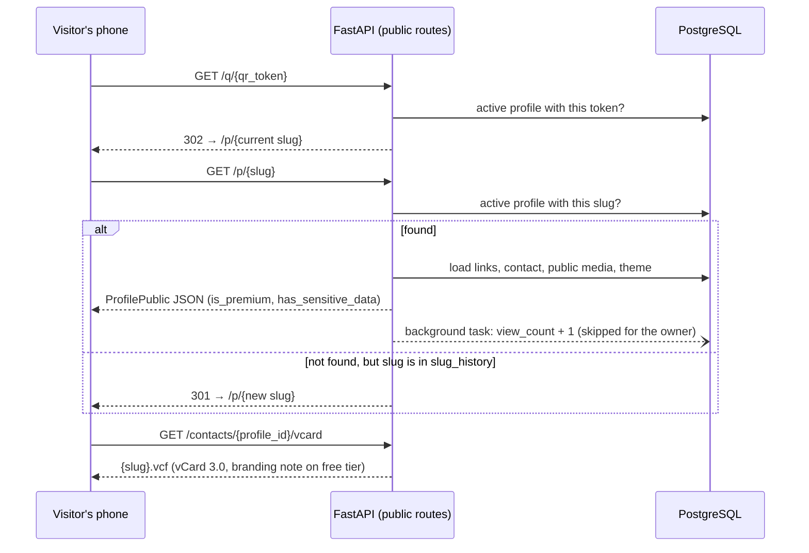
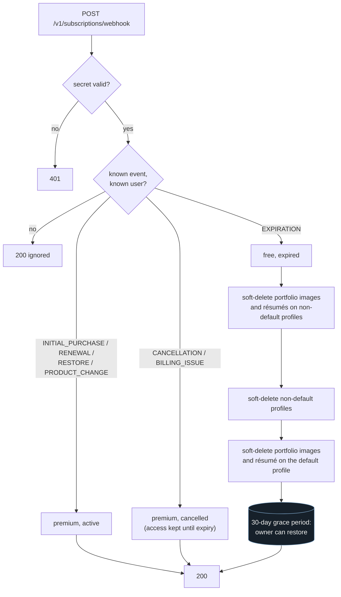

# Architecture

How LinkLeaf's pieces fit together, drawn from the code in this repo. The backend API
passes its test suite in CI but has never been deployed. The Flutter app is a UI prototype
on mock data, and its API client isn't connected yet (dotted lines below).

## System overview

The intended layering is `api/` → `domain/` → `core/`, with domains calling each other
through service functions. The code mostly follows it, with exceptions: some services
query other domains' models directly (for example, the subscription service touches
profiles and media during the expiration cleanup), and a few routers run small queries
themselves.

## Authentication and first login

There's no sign-up endpoint. Firebase handles credentials, and the backend creates a user
the first time it sees an allowlisted UID. The first two steps are the planned app flow;
the app doesn't call Firebase or the API yet.

```mermaid
sequenceDiagram
  participant App as Flutter app
  participant API as FastAPI (auth/dependencies.py)
  participant DB as PostgreSQL
  rect rgb(42, 31, 20)
    Note over App,Firebase: planned, not wired in the app yet
    App->>Firebase: sign in
    Firebase-->>App: ID token
  end
  App->>API: request with Authorization: Bearer <token>
  rect rgb(42, 31, 20)
    API->>Firebase: verify_id_token (Admin SDK)
    Firebase-->>API: uid, email
  end
  alt UID not in ALLOWED_FIREBASE_UIDS
    API-->>App: 403 (or anonymous on optional-auth routes)
  else allowed
    API->>DB: find user by firebase_uid
    opt first login
      API->>DB: create user + free subscription
    end
    API-->>App: response
    API--)DB: background task: update last_login_at
  end
```

## QR scan, public profile and "Save contact"

Printed QR codes point at an immutable token, never at the slug, so renaming a profile
can't break a card that's already been handed out.

`/p/{slug}` returns JSON. The web page meant to render it (planned in Next.js) was never
built.

## Subscription lifecycle

RevenueCat reports purchases and expirations by webhook. A bad secret gets a 401; unknown
events, malformed payloads and unknown users get `200 ignored`, so RevenueCat doesn't keep
retrying events the backend chose to skip.

